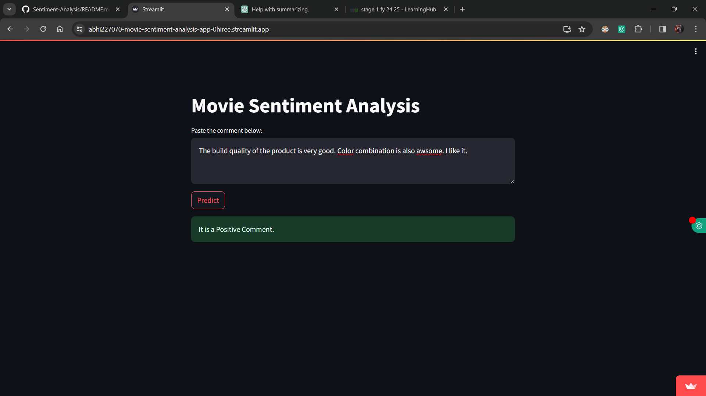

# Movie Sentiment Analysis

Analyze the sentiment of comments using machine learning algorithms and natural language processing (NLP) techniques such as TF-IDF vectorization and stemming. This tool provides insights into the overall sentiment of products or videos based on the comments section, helping businesses gain valuable feedback on their products.

## Table of Contents

- [Introduction](#introduction)
- [Technologies/Tools Used](#technologies-tools-used)
- [Description](#description)
- [Installation](#installation)
- [Usage](#usage)
- [Screenshots](#screenshots)
- [Contributing](#contributing)
- [License](#license)

## Introduction

Movie Sentiment Analysis is a tool that utilizes machine learning algorithms to analyze the sentiment of comments. By leveraging natural language processing (NLP) techniques such as TF-IDF vectorization and stemming, this project provides valuable insights into the overall sentiment of products or videos based on the comments section.

## Technologies/Tools Used

- Python
- Streamlit
- NLTK
- Pickle

## Description

This project analyzes the sentiment of comments using a pre-trained machine learning model and TF-IDF vectorization. The text data is preprocessed using stemming and other NLP techniques to enhance the accuracy of sentiment analysis. Businesses can use this tool to gain insights into the overall sentiment of their products or videos based on user feedback.

## Installation

1. Clone the repository:

    ```bash
    git clone https://github.com/your_username/movie-sentiment-analysis.git
    ```

2. Install dependencies:

    ```bash
    pip install -r requirements.txt
    ```

## Usage

1. Run the Streamlit web application:

    ```bash
    streamlit run app.py
    ```

2. Paste the comment in the provided text area.
3. Click the "Predict" button to analyze the sentiment of the comment.

## Screenshots




<!-- Add more screenshots as needed -->

## Contributing

Contributions are welcome! Please fork the repository and create a pull request with your proposed changes.

## License

This project is licensed under the [MIT License](LICENSE).
